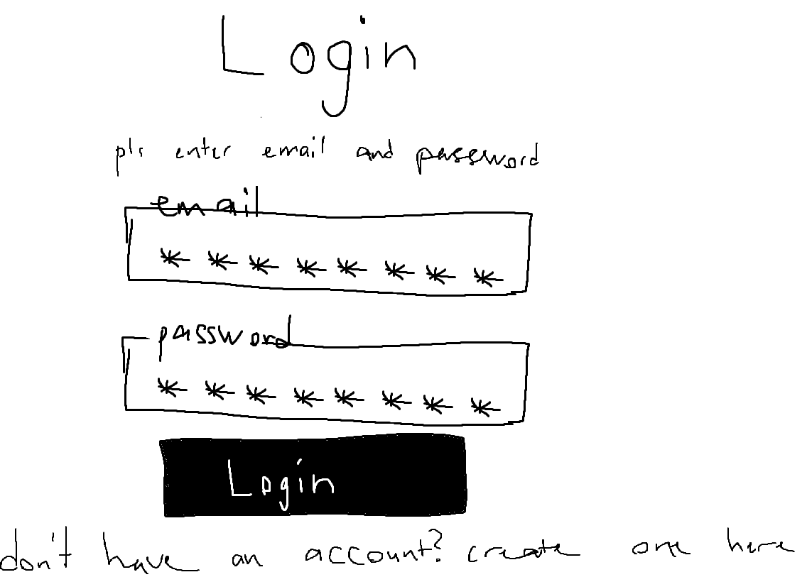
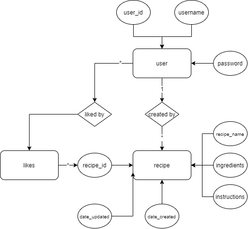

# Projektplan

## 1. Projektbeskrivning (Beskriv vad sidan ska kunna göra).
      Tänker skapa en recept-hemsida där användare ska kunna registera sig och och logga in. När användarna väl är inloggade så ska de kunna se andras recept, samt skapa egna recept. Recepten ska kunna bli redigerade, samt så skall de kunna visa upp valfria bilder. För att komplicera till det lite så har jag valt att lägga till en "like" funktion. För att möjligen göra det svårare i framtiden så kan jag skapa en "kategori funktion", en "svårhetsgrad funktion", en "ingredienser funktion", och en "kommentarer funktion". Färgarangera receptsvårighet, grönt är lätt, gult är medelsvårt, och rött är svårt.

## 2. Vyer (visa bildskisser på dina sidor).

## 3. Databas med ER-diagram (Bild på ER-diagram).

## 4. Arkitektur (Beskriv filer och mappar - vad gör/innehåller de?).
      
      
